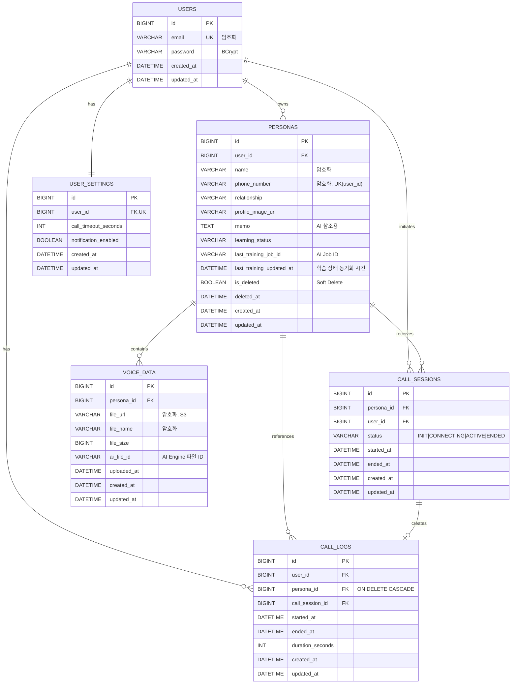

# Dot Backend - Database Schema Documentation

## 📊 ERD (Entity Relationship Diagram)



---

## 🎯 아키텍처 결정사항

### TRAINING_JOBS 테이블 제거 ✅

**결정**: 학습 작업 상태는 AI Engine이 관리하고, REST API는 메타데이터만 캐싱

**이유**:
- ✅ 명확한 책임 분리 (AI 작업은 AI API가 소유)
- ✅ 독립적 확장 가능 (AI Engine 변경 시 REST API 영향 없음)
- ✅ 단순한 스키마 (비즈니스 도메인에 집중)

**구현 방식**:
```
PERSONAS 테이블:
├─ learning_status (캐시된 상태)
├─ last_training_job_id (AI에서 받은 ID)
└─ last_training_updated_at (동기화 시간)

AI API (외부):
└─ TRAINING_JOBS (AI 내부 관리)
```

---

### CALL_SESSIONS의 duration_seconds 제거 ✅

**결정**: 통화 시간은 `started_at`과 `ended_at`으로 동적 계산

**이유**:
- ✅ 단일 진실 공급원 (Single Source of Truth) - `started_at`, `ended_at`만 관리
- ✅ 데이터 정합성 보장 - duration이 잘못 저장될 위험 제거
- ✅ 계산 비용 무시 가능 - Duration.between() 연산은 매우 빠름

**구현 방식**:
```java
@Entity
public class CallSession {
    private LocalDateTime startedAt;
    private LocalDateTime endedAt;

    // Getter로 동적 계산
    public Integer getDurationSeconds() {
        if (startedAt == null || endedAt == null) {
            return null;
        }
        return (int) Duration.between(startedAt, endedAt).getSeconds();
    }
}
```

**call_logs는 duration_seconds 유지**:
- 이력 조회용 테이블이므로 성능 최적화를 위해 미리 계산된 값 저장
- 세션 종료 시 `CallLog.fromSession()`에서 한 번만 계산

---

## 🗂️ 테이블 상세 설명

### 1. `users` - 회원 테이블

**목적**: 시스템 사용자 정보 저장

**주요 필드**:
- `email`: 암호화 저장 (AES-256)
- `password`: BCrypt 해싱

**제약사항**:
- 이메일 중복 불가 (UNIQUE)
- 비밀번호는 BCrypt 해싱 필수

**변경사항**:
- ~~`is_active` 제거~~ (현재 단계에서 불필요)

---

### 2. `user_settings` - 사용자 설정 테이블

**목적**: 개인화 설정 관리

**주요 필드**:
- `call_timeout_seconds`: 통화 연결 대기 타임아웃 (기본 300초)
- `notification_enabled`: 학습 완료 알림 수신 여부

**관계**:
- User와 1:1 관계
- User 삭제 시 CASCADE 삭제

---

### 3. `personas` - Persona (전화번호부) 테이블

**목적**: 고인 또는 학습 대상자 정보 관리

**주요 필드**:
- `name`, `phone_number`: 암호화 저장
- `memo`: AI가 대화 생성 시 참조할 메모
- `learning_status`: NOT_STARTED | IN_PROGRESS | COMPLETED | FAILED
- `last_training_job_id`: AI Engine에서 반환한 Job ID (외부 참조)
- `last_training_updated_at`: 마지막 학습 상태 동기화 시간
- `is_deleted`: Soft Delete 플래그
- `deleted_at`: 삭제 시점 (30일 후 Hard Delete)

**제약사항**:
- `(user_id, phone_number)` 복합 UNIQUE
- Soft Delete 적용 (30일 유예)

**비즈니스 규칙**:
- 삭제 후 30일 경과 시 배치 작업으로 완전 삭제
- Persona 삭제 시 관련 모든 데이터 CASCADE 삭제

**AI 연동**:
- 학습 상태는 AI API에서 조회하여 캐싱
- Webhook으로 실시간 상태 동기화

---

### 4. `voice_data` - 음성 파일 메타데이터 테이블

**목적**: S3에 저장된 음성 파일 정보 관리

**주요 필드**:
- `file_url`: S3 URL (암호화)
- `file_name`: 원본 파일명 (암호화)
- `file_size`: 바이트 단위
- `ai_file_id`: AI Engine에 업로드된 파일 ID (외부 참조)

**관계**:
- Persona 삭제 시 CASCADE 삭제

---

### 5. `call_sessions` - 통화 세션 테이블

**목적**: 진행 중인 통화 세션 관리

**상태 흐름** (State Machine):
```
INIT → CONNECTING → ACTIVE → ENDED
CONNECTING → ENDED
ACTIVE → ENDED
```

**Domain Invariant**:
- **Persona당 ACTIVE 상태는 1개만 허용**

**주요 필드**:
- `status`: 통화 상태 (INIT, CONNECTING, ACTIVE, ENDED)
- `started_at`: 통화 시작 시간
- `ended_at`: 통화 종료 시간

**통화 시간 계산**:
```java
// Entity에서 getter로 동적 계산
public Integer getDurationSeconds() {
    if (startedAt == null || endedAt == null) {
        return null;
    }
    return (int) Duration.between(startedAt, endedAt).getSeconds();
}
```

**설계 결정**:
- ~~`duration_seconds` 컬럼 제거~~ (단일 진실 공급원 원칙)
- `started_at`과 `ended_at`으로 동적 계산
- 데이터 정합성 보장

---

### 6. `call_logs` - 통화 기록 테이블

**목적**: 최근 통화 목록 및 이력 조회

**주요 필드**:
- `duration_seconds`: **미리 계산된 통화 시간** (성능 최적화)
- 종료된 세션의 복사본

**주요 특징**:
- Persona 삭제 시 함께 CASCADE 삭제 (보안 우선)
- `idx_call_log_user_started` 인덱스로 빠른 조회
- duration은 세션 종료 시 한 번만 계산하여 저장

**성능 최적화**:
- Redis 캐싱 적용 예정
- 페이징 지원 (기본 20건)

---

## 🔐 보안 정책

### 암호화 대상 필드
- `users.email`
- `personas.name`
- `personas.phone_number`
- `voice_data.file_url`
- `voice_data.file_name`

**암호화 방식**: AES-256-GCM

### CASCADE DELETE 정책

```
User 삭제 시:
├── UserSettings (CASCADE)
├── Personas (CASCADE)
│   ├── VoiceData (CASCADE)
│   ├── CallSessions (CASCADE)
│   └── CallLogs (CASCADE)
└── CallLogs (CASCADE)

Persona 삭제 시:
├── Soft Delete (is_deleted = true, deleted_at 기록)
├── 30일 유예 기간
└── 배치 작업으로 Hard Delete
    ├── VoiceData (CASCADE)
    ├── CallSessions (CASCADE)
    └── CallLogs (CASCADE)
```

---

## 🔄 AI Engine 연동 아키텍처

### 학습 작업 흐름

```
1. [REST API] 학습 시작 요청
   ↓
2. [REST API] Persona.learning_status = IN_PROGRESS
   ↓
3. [REST API → AI API] createTrainingJob() 호출
   ↓
4. [AI API] TrainingJob 생성 (AI 내부 DB에 저장)
   ↓
5. [AI API → REST API] jobId 반환
   ↓
6. [REST API] Persona.last_training_job_id = jobId 저장
   ↓
7. [AI API] 비동기 학습 진행
   ↓
8. [AI API → REST API] Webhook: 상태 업데이트
   ↓
9. [REST API] Persona.learning_status 동기화
```

### AI API 인터페이스

```java
// REST API에서 정의
public interface AiApiClient {
    TrainingJobResponse createTrainingJob(TrainingJobRequest request);
    TrainingJobStatusResponse getJobStatus(String jobId);
    void cancelJob(String jobId);
    String uploadVoiceFile(Long personaId, String fileUrl);
}
```

---

## 📁 파일 구조

```
backend/
├── src/main/java/com/dot/backend/
│   ├── client/
│   │   └── ai/
│   │       ├── AiApiClient.java (Interface)
│   │       ├── DevAiApiClient.java (개발용 Mock)
│   │       ├── AiApiClientImpl.java (프로덕션용)
│   │       ├── TrainingJobRequest.java
│   │       ├── TrainingJobResponse.java
│   │       └── TrainingJobStatusResponse.java
│   ├── domain/
│   │   ├── common/
│   │   │   └── BaseEntity.java
│   │   ├── user/
│   │   │   ├── User.java
│   │   │   ├── UserSettings.java
│   │   │   └── repository/
│   │   │       ├── UserRepository.java
│   │   │       └── UserSettingsRepository.java
│   │   ├── persona/
│   │   │   ├── Persona.java
│   │   │   ├── LearningStatus.java
│   │   │   └── repository/
│   │   │       └── PersonaRepository.java
│   │   ├── voice/
│   │   │   ├── VoiceData.java
│   │   │   └── repository/
│   │   │       └── VoiceDataRepository.java
│   │   └── call/
│   │       ├── CallSession.java
│   │       ├── CallSessionStatus.java
│   │       ├── CallLog.java
│   │       └── repository/
│   │           ├── CallSessionRepository.java
│   │           └── CallLogRepository.java
│   └── config/
│       ├── JpaConfig.java
│       └── RestClientConfig.java
└── src/main/resources/
    ├── application.yml
    └── db/migration/
        ├── V1__create_users_table.sql
        ├── V2__create_user_settings_table.sql
        ├── V3__create_personas_table.sql
        ├── V4__create_voice_data_table.sql
        ├── V5__create_call_sessions_table.sql
        └── V6__create_call_logs_table.sql
```

---

## 🚀 실행 방법

### 1. 프로젝트 빌드
```bash
cd backend
./gradlew build
```

### 2. 개발 환경 실행 (H2 DB)
```bash
./gradlew bootRun --args='--spring.profiles.active=dev'
```

### 3. H2 Console 접속
```
URL: http://localhost:8080/h2-console
JDBC URL: jdbc:h2:mem:dotdb
Username: sa
Password: (비워두기)
```

### 4. Flyway 마이그레이션 확인
애플리케이션 시작 시 자동으로 실행됩니다.

---

## 🔍 주요 쿼리 예시

### 1. 활성 Persona 조회
```java
List<Persona> personas = personaRepository.findActiveByUserId(userId);
```

### 2. 최근 통화 목록 (20건)
```java
List<CallLog> recentCalls = callLogRepository
    .findByUserIdOrderByStartedAtDesc(userId, PageRequest.of(0, 20));
```

### 3. Persona의 활성 통화 세션 확인
```java
Optional<CallSession> activeSession = callSessionRepository
    .findActiveSessionByPersonaId(personaId);
```

### 4. 통화 시간 조회 (동적 계산)
```java
CallSession session = callSessionRepository.findById(sessionId).orElseThrow();
Integer duration = session.getDurationSeconds(); // started_at과 ended_at으로 계산
```

### 5. 30일 경과 Persona 삭제 (배치)
```java
LocalDateTime threshold = LocalDateTime.now().minusDays(30);
List<Persona> expired = personaRepository
    .findExpiredDeletedPersonas(threshold);
personaRepository.deleteAll(expired); // CASCADE 동작
```

---

## ✅ 다음 단계

- [ ] Service Layer 구현
- [ ] Controller 및 DTO 생성
- [ ] Spring Security + JWT 설정
- [ ] 암호화 유틸리티 구현
- [ ] S3 파일 업로드 서비스
- [ ] WebSocket 설정 (실시간 통화)
- [ ] AI Engine 연동 Interface
- [ ] API 문서 (Swagger/OpenAPI)
- [ ] 단위 테스트 작성


