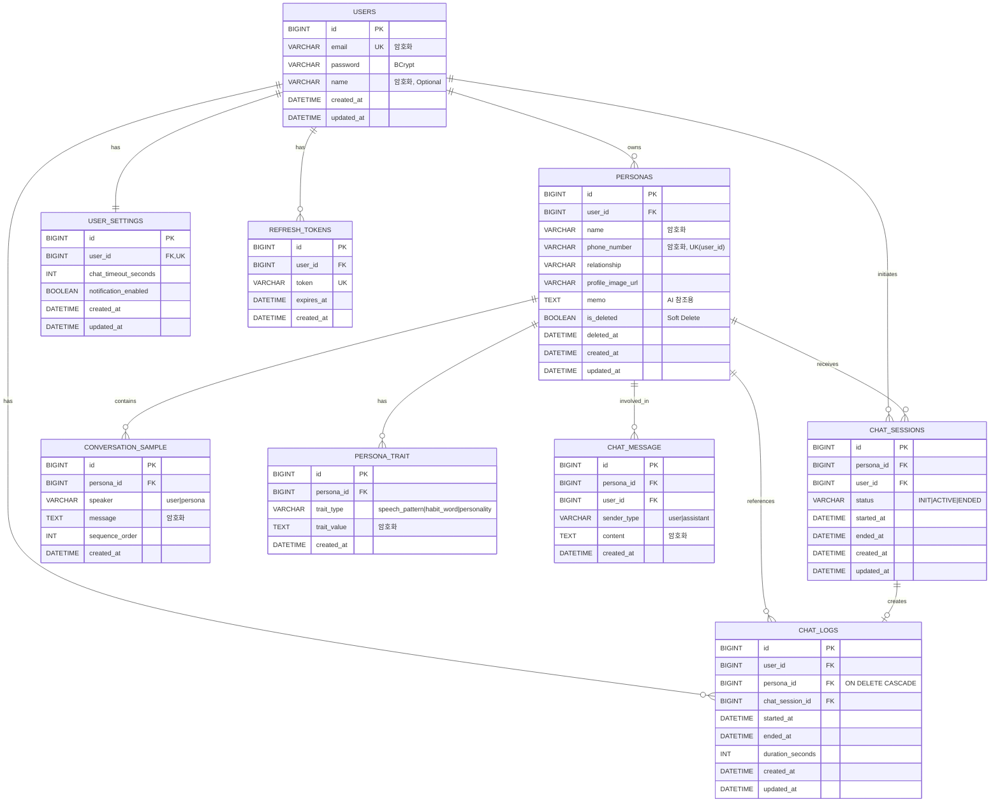

# Dot Backend - Database Schema Documentation

## 📊 ERD (Entity Relationship Diagram)



---

## 🎯 아키텍처 결정사항

### 텍스트 기반 채팅으로 전환 ✅

**변경사항**:
```
제거:
├─ voice_data (음성 파일 메타데이터)
├─ training_jobs (AI 학습 작업 - AI API로 이관)
└─ call_sessions.CONNECTING 상태

추가:
├─ conversation_sample (대화 샘플)
├─ persona_trait (성향 정보)
├─ chat_message (채팅 메시지)
└─ chat_sessions (call_sessions 대체)
```

---

### CHAT_SESSIONS의 duration_seconds 제거 ✅

**결정**: 채팅 시간은 `started_at`과 `ended_at`으로 동적 계산

**이유**:
- ✅ 단일 진실 공급원 (Single Source of Truth) - `started_at`, `ended_at`만 관리
- ✅ 데이터 정합성 보장 - duration이 잘못 저장될 위험 제거
- ✅ 계산 비용 무시 가능 - Duration.between() 연산은 매우 빠름

**구현 방식**:
```java
@Entity
public class ChatSession {
    private LocalDateTime startedAt;
    private LocalDateTime endedAt;

    // Getter로 동적 계산
    public Integer getDurationSeconds() {
        if (startedAt == null || endedAt == null) {
            return null;
        }
        return (int) Duration.between(startedAt, endedAt).getSeconds();
    }
}
```

**chat_logs는 duration_seconds 유지**:
- 이력 조회용 테이블이므로 성능 최적화를 위해 미리 계산된 값 저장
- 세션 종료 시 `ChatLog.fromSession()`에서 한 번만 계산

---

## 🗂️ 테이블 상세 설명

### 1. `users` - 회원 테이블

**목적**: 시스템 사용자 정보 저장

**주요 필드**:
- `email`: 암호화 저장 (AES-256)
- `password`: BCrypt 해싱

**제약사항**:
- 이메일 중복 불가 (UNIQUE)
- 비밀번호는 BCrypt 해싱 필수

**변경사항**:
- ~~`is_active` 제거~~ (현재 단계에서 불필요)

---

### 2. `user_settings` - 사용자 설정 테이블

**목적**: 개인화 설정 관리

**주요 필드**:
- `call_timeout_seconds`: 통화 연결 대기 타임아웃 (기본 300초)
- `notification_enabled`: 학습 완료 알림 수신 여부

**관계**:
- User와 1:1 관계
- User 삭제 시 CASCADE 삭제

---

### 3. `personas` - Persona (전화번호부) 테이블

**목적**: 고인 또는 학습 대상자 정보 관리

**주요 필드**:
- `name`, `phone_number`: 암호화 저장
- `relationship`: 관계 (어머니, 아버지, 친구 등)
- `profile_image_url`: S3 프로필 이미지
- `memo`: AI가 대화 생성 시 참조할 메모 (시스템 프롬프트 생성에 사용)
- `is_deleted`: Soft Delete 플래그
- `deleted_at`: 삭제 시점 (30일 후 Hard Delete)

**제약사항**:
- `(user_id, phone_number)` 복합 UNIQUE
- Soft Delete 적용 (30일 유예)

**비즈니스 규칙**:
- 삭제 후 30일 경과 시 배치 작업으로 완전 삭제
- Persona 삭제 시 관련 모든 데이터 CASCADE 삭제

**채팅 가능 조건**:
- 삭제되지 않은 상태
- 최소 1개 이상의 ConversationSample 또는 memo가 존재

---

### 4. `conversation_sample` - 대화 샘플 테이블

**목적**: AI 학습용 대화 샘플 저장

**주요 필드**:
- `speaker`: user | persona (누가 한 말인지)
- `message`: 대화 내용 (암호화)
- `sequence_order`: 대화 순서

**관계**:
- Persona 삭제 시 CASCADE 삭제

**사용 예시**:
```
speaker: "persona", message: "오늘 날씨 좋다~"
speaker: "user", message: "진짜 맑네요"
speaker: "persona", message: "산책 갈까? ㅋㅋ"
```

---

### 5. `persona_trait` - 성향 정보 테이블

**목적**: Persona의 말투, 습관어, 성격 특성 저장

**주요 필드**:
- `trait_type`: speech_pattern | habit_word | personality
- `trait_value`: 성향 값 (암호화)

**관계**:
- Persona 삭제 시 CASCADE 삭제

**사용 예시**:
```
trait_type: "speech_pattern", trait_value: "~인 것 같아"
trait_type: "habit_word", trait_value: "ㅋㅋ"
trait_type: "personality", trait_value: "친절하고 밝음"
```

---

### 6. `chat_sessions` - 채팅 세션 테이블

**목적**: 진행 중인 채팅 세션 관리

**상태 흐름** (State Machine):
```
INIT → ACTIVE → ENDED
```

**Domain Invariant**:
- **Persona당 ACTIVE 상태는 1개만 허용**

**주요 필드**:
- `status`: 채팅 상태 (INIT, ACTIVE, ENDED)
- `started_at`: 채팅 시작 시간
- `ended_at`: 채팅 종료 시간

**채팅 시간 계산**:
```java
// Entity에서 getter로 동적 계산
public Integer getDurationSeconds() {
    if (startedAt == null || endedAt == null) {
        return null;
    }
    return (int) Duration.between(startedAt, endedAt).getSeconds();
}
```

**설계 결정**:
- ~~`duration_seconds` 컬럼 제거~~ (단일 진실 공급원 원칙)
- `started_at`과 `ended_at`으로 동적 계산
- 데이터 정합성 보장

---

### 7. `chat_logs` - 채팅 기록 테이블

**목적**: 최근 채팅 목록 및 이력 조회

**주요 필드**:
- `duration_seconds`: **미리 계산된 채팅 시간** (성능 최적화)
- 종료된 세션의 복사본

**주요 특징**:
- Persona 삭제 시 함께 CASCADE 삭제 (보안 우선)
- `idx_chat_log_user_started` 인덱스로 빠른 조회
- duration은 세션 종료 시 한 번만 계산하여 저장

**성능 최적화**:
- Redis 캐싱 적용 예정
- 페이징 지원 (기본 20건)

---

### 8. `chat_message` - 채팅 메시지 테이블

**목적**: 실제 채팅 대화 내용 저장

**주요 필드**:
- `sender_type`: user | assistant
- `content`: 메시지 내용 (암호화)

**관계**:
- Persona 삭제 시 CASCADE 삭제
- User 삭제 시 CASCADE 삭제

**사용 용도**:
- 대화 기록 조회
- AI 컨텍스트 관리 (최근 N개 메시지)

---

## 🔐 보안 정책

### 암호화 대상 필드
- `users.email`
- `users.name`
- `personas.name`
- `personas.phone_number`
- `conversation_sample.message`
- `persona_trait.trait_value`
- `chat_message.content`

**암호화 방식**: AES-256-GCM

### CASCADE DELETE 정책

```
User 삭제 시:
├── UserSettings (CASCADE)
├── RefreshTokens (CASCADE)
├── Personas (CASCADE)
│   ├── ConversationSample (CASCADE)
│   ├── PersonaTrait (CASCADE)
│   ├── ChatSessions (CASCADE)
│   ├── ChatLogs (CASCADE)
│   └── ChatMessage (CASCADE)
├── ChatSessions (CASCADE)
├── ChatLogs (CASCADE)
└── ChatMessage (CASCADE)

Persona 삭제 시:
├── Soft Delete (is_deleted = true, deleted_at 기록)
├── 30일 유예 기간
└── 배치 작업으로 Hard Delete
    ├── ConversationSample (CASCADE)
    ├── PersonaTrait (CASCADE)
    ├── ChatSessions (CASCADE)
    ├── ChatLogs (CASCADE)
    └── ChatMessage (CASCADE)
```

---

## 🔄 AI Engine 연동 아키텍처

### 학습 작업 흐름

```
1. [REST API] 학습 시작 요청
   ↓
2. [REST API] Persona.learning_status = IN_PROGRESS
   ↓
3. [REST API → AI API] createTrainingJob() 호출
   ↓
4. [AI API] TrainingJob 생성 (AI 내부 DB에 저장)
   ↓
5. [AI API → REST API] jobId 반환
   ↓
6. [REST API] Persona.last_training_job_id = jobId 저장
   ↓
7. [AI API] 비동기 학습 진행
   ↓
8. [AI API → REST API] Webhook: 상태 업데이트
   ↓
9. [REST API] Persona.learning_status 동기화
```

### AI API 인터페이스

```java
// REST API에서 정의
public interface AiApiClient {
    TrainingJobResponse createTrainingJob(TrainingJobRequest request);
    TrainingJobStatusResponse getJobStatus(String jobId);
    void cancelJob(String jobId);
    String uploadVoiceFile(Long personaId, String fileUrl);
}
```

---

## 📁 파일 구조

```
backend/
├── src/main/java/com/dot/backend/
│   ├── domain/
│   │   ├── common/
│   │   │   └── BaseEntity.java
│   │   ├── user/
│   │   │   ├── User.java
│   │   │   ├── UserSettings.java
│   │   │   └── repository/
│   │   │       ├── UserRepository.java
│   │   │       └── UserSettingsRepository.java
│   │   ├── persona/
│   │   │   ├── Persona.java
│   │   │   ├── LearningStatus.java
│   │   │   └── repository/
│   │   │       └── PersonaRepository.java
│   │   ├── voice/
│   │   │   ├── VoiceData.java
│   │   │   └── repository/
│   │   │       └── VoiceDataRepository.java
│   │   └── call/
│   │       ├── CallSession.java
│   │       ├── CallSessionStatus.java
│   │       ├── CallLog.java
│   │       └── repository/
│   │           ├── CallSessionRepository.java
│   │           └── CallLogRepository.java
│   └── config/
│       ├── JpaConfig.java
│       └── RestClientConfig.java
└── src/main/resources/
    ├── application.yml
    └── db/migration/
        ├── V1__create_users_table.sql
        ├── V2__create_user_settings_table.sql
        ├── V3__create_personas_table.sql
        ├── V4__create_voice_data_table.sql
        ├── V5__create_call_sessions_table.sql
        └── V6__create_call_logs_table.sql
```

---

## 🚀 실행 방법

### 1. 프로젝트 빌드
```bash
cd backend
./gradlew build
```

### 2. 개발 환경 실행 (H2 DB)
```bash
./gradlew bootRun --args='--spring.profiles.active=dev'
```

### 3. H2 Console 접속
```
URL: http://localhost:8080/h2-console
JDBC URL: jdbc:h2:mem:dotdb
Username: sa
Password: (비워두기)
```

### 4. Flyway 마이그레이션 확인
애플리케이션 시작 시 자동으로 실행됩니다.

---

## 🔍 주요 쿼리 예시

### 1. 활성 Persona 조회
```java
List<Persona> personas = personaRepository.findActiveByUserId(userId);
```

### 2. 최근 채팅 목록 (20건)
```java
List<ChatLog> recentChats = chatLogRepository
    .findByUserIdOrderByStartedAtDesc(userId, PageRequest.of(0, 20));
```

### 3. Persona의 활성 채팅 세션 확인
```java
Optional<ChatSession> activeSession = chatSessionRepository
    .findActiveSessionByPersonaId(personaId);
```

### 4. 채팅 시간 조회 (동적 계산)
```java
ChatSession session = chatSessionRepository.findById(sessionId).orElseThrow();
Integer duration = session.getDurationSeconds(); // started_at과 ended_at으로 계산
```

### 5. 30일 경과 Persona 삭제 (배치)
```java
LocalDateTime threshold = LocalDateTime.now().minusDays(30);
List<Persona> expired = personaRepository
    .findExpiredDeletedPersonas(threshold);
personaRepository.deleteAll(expired); // CASCADE 동작
```

### 6. Persona의 대화 샘플 조회
```java
List<ConversationSample> samples = conversationSampleRepository
    .findByPersonaIdOrderBySequenceOrder(personaId);
```

### 7. Persona의 성향 정보 조회
```java
List<PersonaTrait> traits = personaTraitRepository
    .findByPersonaId(personaId);
```

### 8. 최근 채팅 메시지 조회 (컨텍스트용)
```java
List<ChatMessage> context = chatMessageRepository
    .findRecentMessages(personaId, userId, 10); // 최근 10개
```

---

## ✅ 다음 단계

- [ ] Persona Service Layer 구현
- [ ] PersonaTrait, ConversationSample 관리 API
- [ ] ChatService 구현
- [ ] ChatAiService 인터페이스 및 Mock 구현
- [ ] Controller 및 DTO 생성
- [ ] Spring Security + JWT 설정 (완료)
- [ ] 암호화 유틸리티 구현
- [ ] ChatController 구현
- [ ] API 문서 (Swagger/OpenAPI)
- [ ] 단위 테스트 작성


